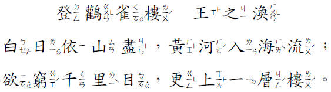

# 漢語音標

## 十五音

### [十五音](./shi_wu_yin/)

傳統漢學十五音。

### [彙音寶鑑](./hui_yin/)

傳統漢學十五音改良版。

## 注音符號

### [方音符號](fang_yin/)

吳守禮先生，將「注音符號」改良、裁剪，使之適用於標註台語發音。

### [無名台語注音](wu_ming/)

同屬注音符號改良後的台語發聲方法，因作者未示其名，故暫稱：無名台語注音。

## 羅馬拚音

 - [學台羅拚音－第一篇：聲母（子音）](https://www.youtube.com/watch?v=92q7mAF_8EY)
 - [學台羅拚音－第二篇：韻母（母音）／韻尾](https://www.youtube.com/watch?v=D2uxHOKkpFY&t=0s)
 - [學台羅拚音－第三篇：淺規則／白話字](https://www.youtube.com/watch?v=GxLz5pkHqO4&t=0s)
 - [學台羅拚音－第四篇：聲調／變調](https://www.youtube.com/watch?v=TO5i0dZ7xVA&t=0s)

 - [台羅拼音歌](https://www.youtube.com/watch?v=QZt43n9NAnI)

**【台羅拚音】**

**【台羅拚音簡式】**

 - [台語通用羅馬拼音](https://www.youtube.com/watch?v=2dVO4OkjOU8)

## 其它方法

 - [漢語拚音學台語](https://www.youtube.com/watch?v=k2Bxdl_uhoA)

## 參考文章

 - [歡喜講台語 v0.2](https://blog.xuite.net/hn88196555/twblog/92391128)
