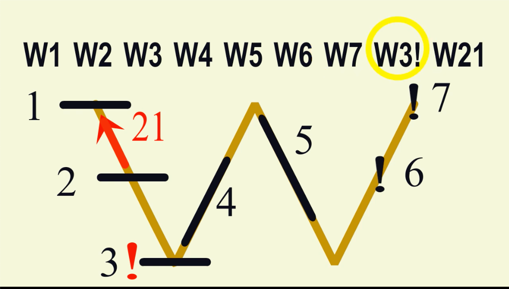

# 漢語音標

## 十五音

 - [十五音](./shi_wu_yin/)

 - [彙音寶鑑](/d02/hui_yin/)

## 注音符號

 - [方音符號](fang_yin/)

## 注音符號改良

 - [台語注音符號](https://www.youtube.com/watch?v=EEndKSmeG5I&list=PL3-KKGFJdGz0lOJXfmMOZOUpYSC94TJxX)：台語音標，只須改良現有的國語注音符號。

 - [台語注音符號可以用唱的喔](https://www.youtube.com/watch?v=vEulNQ-NWzY&list=PL3-KKGFJdGz0lOJXfmMOZOUpYSC94TJxX&index=4)

 - [台語注音符號 ABC](https://www.youtube.com/watch?v=k2Bxdl_uhoA&list=PL3-KKGFJdGz0lOJXfmMOZOUpYSC94TJxX&index=6)：令台語注音符號可在電腦輸入。

 - [用一個W掌握台語聲調](https://www.youtube.com/watch?v=lfSNWNlcNeA&list=PL3-KKGFJdGz0lOJXfmMOZOUpYSC94TJxX&index=2)

 - [台語變調規則](https://www.youtube.com/watch?v=fyfTqM8UMg8&list=PL3-KKGFJdGz0lOJXfmMOZOUpYSC94TJxX&index=3)

## 羅馬拚音

 - [學台羅拚音－第一篇：聲母（子音）](https://www.youtube.com/watch?v=92q7mAF_8EY)
 - [學台羅拚音－第二篇：韻母（母音）／韻尾](https://www.youtube.com/watch?v=D2uxHOKkpFY&t=0s)
 - [學台羅拚音－第三篇：淺規則／白話字](https://www.youtube.com/watch?v=GxLz5pkHqO4&t=0s)
 - [學台羅拚音－第四篇：聲調／變調](https://www.youtube.com/watch?v=TO5i0dZ7xVA&t=0s)

 - [台羅拼音歌](https://www.youtube.com/watch?v=QZt43n9NAnI)

**【台羅拚音】**

**【台羅拚音簡式】**

 - [台語通用羅馬拼音](https://www.youtube.com/watch?v=2dVO4OkjOU8)

## 其它方法

 - [漢語拚音學台語](https://www.youtube.com/watch?v=k2Bxdl_uhoA)

## 參考文章

 - [歡喜講台語 v0.2](https://blog.xuite.net/hn88196555/twblog/92391128)
