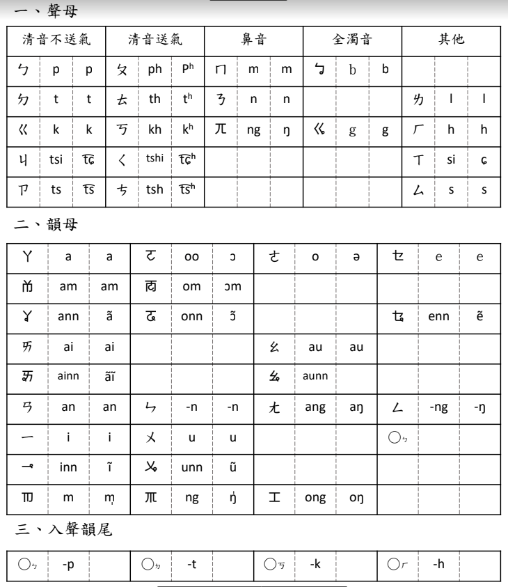

# 漢語音標

## 十五音

### [十五音](./shi_wu_yin/)

傳統漢學十五音。

### [彙音寶鑑](./hui_yin/)

傳統漢學十五音改良版。

## 注音符號

### [方音符號](fang_yin/)

吳守禮先生，將「注音符號」改良、裁剪，使之適用於標註台語發音。

**【符號總表】**

### [無名台語注音](wu_ming/)

同屬注音符號改良後的台語發聲方法，因作者未示其名，故暫稱：無名台語注音。

這套拚音方法論，目前的教材只找得到：教學影片，未見正式的「文件」說明。自影片內容
採討，似乎跟「方音符號」（或稱：台語注音符號）相似；但是方音符號中許多「台語專用
的韻母符號」，此方法論卻未見；另外，此套方法論亦強調能用於電腦輸入，其「注音符號」
幾乎可用「漢語拚音」代，所以只要熟悉「英文鍵盤」的排列方式，便能使用此套拚音方法
論輸入「注音符號」。

對於學過：注音符號、漢語拚音的使用者，這套注音方法應能快速上手。但要注意：這套注
音方法論，其「聲調」標示方法，大致同「方音符號」的「台語七聲調」。

**【聲母／韻母符號總表】**

**【電腦按鍵】**

**【聲調符號】**

## 羅馬拚音

### 台羅拼音

 - [學台羅拚音－第一篇：聲母（子音）](https://www.youtube.com/watch?v=92q7mAF_8EY)
 - [學台羅拚音－第二篇：韻母（母音）／韻尾](https://www.youtube.com/watch?v=D2uxHOKkpFY&t=0s)
 - [學台羅拚音－第三篇：淺規則／白話字](https://www.youtube.com/watch?v=GxLz5pkHqO4&t=0s)
 - [學台羅拚音－第四篇：聲調／變調](https://www.youtube.com/watch?v=TO5i0dZ7xVA&t=0s)

 - [台羅拼音歌](https://www.youtube.com/watch?v=QZt43n9NAnI)

**【台羅拚音】**

**【台羅拚音簡式】**

 - [台語通用羅馬拼音](https://www.youtube.com/watch?v=2dVO4OkjOU8)

## 通用拼音

### [通用台語注音](./tong_yong_tai_yu_zhu_yin)

由「王啟陽」先生推展的「台語拼音方法」，其特點：
 - 現有的「國語注音符號」，添加十個符號，便能當作台語的注音符號；
 - 所有的「台語注音符號」，對映至「電腦鍵盤」的位置，同「通用拼音」。

這套台語拼音方法，王啟陽先生似乎未賦予「名稱」，為了此筆記的編撰之便，個人只好潛越，暫時將之稱作：「通用台語注音」。

## 參考文章

### 國語注音符號

[「國語注音符號」](./zhu_yin)已經淡忘了，需要做個回顧，補強已遺失的記憶。

### 台語注音概論

網路部落格：[歡喜講台語 v0.2](https://blog.xuite.net/hn88196555/twblog/92395011)
，介紹在台灣成為主流的幾種「拚音」方法。
