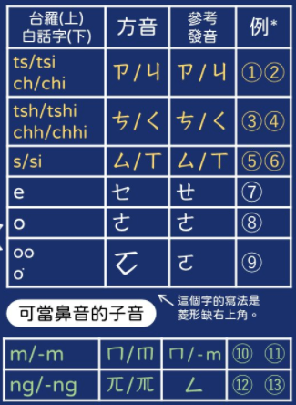

# 方音符號

## 摘要簡介

方音符號，中華民國教育部稱謂為「方音符號系統」，民間又稱為臺語注音符號，是一套用來標注臺灣閩南話和客家話的標音符號。主要以注音符號為基礎，並增加一些國語中所沒有的發音符號，且有發音唯一的特性。

【註】：參考[維基百科：台灣方音符號](https://zh.wikipedia.org/wiki/%E8%87%BA%E7%81%A3%E6%96%B9%E9%9F%B3%E7%AC%A6%E8%99%9F#Unicode)。

## 聲／韻／調結構

指導初學者，認識：
 - 聲母音標
 - 韻母音標
 - 聲調對照

### 聲母

【範例】：

### 韻母

【範例】：

### 入聲尾韻

### 聲調

 1. 陰平：ㄉㆲ   (東)   無號
 2. 陰上：ㄉㆲˋ  (黨)   ˋ
 3. 陰去：ㄉㆲ˪  (棟)   ˪
 4. 陰入：ㄉㆦㄍ (督)   ㄅ, ㄉ, ㄍ, ㄏ
 5. 陽平：ㄉㆲˊ  (同)   ˊ
 7. 陽去：ㄉㆲ˫  (洞)   ˫
 8. 陽入：ㄉㆦㄍ̇ (毒)   ㄅ̇, ㄉ̇, ㄍ̇, ㄏ̇

## 教學影片

### 讀音示範

認識方音符號的「讀音」及「寫法」。

<iframe width="560" height="315" src="https://www.youtube.com/embed/rk7JD6L5lLY" title="YouTube video player" frameborder="0" allow="accelerometer; autoplay; clipboard-write; encrypted-media; gyroscope; picture-in-picture" allowfullscreen></iframe>

### 拚音範例

## 參考文章

 - [方音符號系統](http://acdm3.tcssh.tc.edu.tw/teach/parent_%20language/parent/book/book_9.pdf)

 - [台語的注音符號](https://home.gamer.com.tw/creationDetail.php?sn=4081380)

 - [第1858回-台灣方音符號-1-萌典中的閩南語注音符號](https://glglace.blogspot.com/2021/04/1.html)

 - [致教育部函‥關於方音符號](https://mypaper.pchome.com.tw/avun01/post/1339607736)

 - [吳守禮台語注音輸入法](https://xiaoxue.iis.sinica.edu.tw/download/WSL_TPS_IME.htm)

 - [吳專禮台語注音字型](https://xiaoxue.iis.sinica.edu.tw/download/WSL_TPS_Font.htm)
