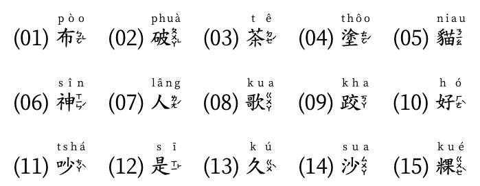

# 方音符號

## 摘要簡介

方音符號，中華民國教育部稱謂為「方音符號系統」，民間又稱為臺語注音符號，是一套用來標注臺灣閩南話和客家話的標音符號。主要以注音符號為基礎，並增加一些國語中所沒有的發音符號，且有發音唯一的特性。

【註】：參考[維基百科：台灣方音符號](https://zh.wikipedia.org/wiki/%E8%87%BA%E7%81%A3%E6%96%B9%E9%9F%B3%E7%AC%A6%E8%99%9F#Unicode)。

### 符號總表

### 國台共用符號

台語注音符號，自「國語注音符號」繼承之部份如下：

**【台語注音符號應用舉例】**

### 台語專用符號

國語注音符號無法滿足，而新創之「台語注音符號」如下：

**【台語注音符號應用舉例】**

## 聲／韻／調結構

指導初學者，認識：
 - 聲母音標
 - 韻母音標
 - 聲調對照

### 聲母

**【聲母符號】**

**【發音說明】**

### 韻母

**【聲母符號】**

**【發音說明】**

### 入聲尾韻

台語有四種入聲，依韻尾的收聲分為兩類：
 1. 韻尾收於「促聲」：ㄅ、ㄉ、ㄍ
 2. 韻尾收於「喉塞」：ㄏ

上述四種入聲又依聲調，各分為陰（上）入聲和陽（下）入聲。

入聲音符符號的表示，是在本音注音音符的右下角附上小號的（ㄅ、ㄉ、ㄍ、
ㄏ）以表示各收於（ㄅ、ㄉ、ㄍ、ㄏ）音的陰入聲，在各陰入聲符號上加一
小圓點以表示陽入聲。

### 聲調

台語有七種聲調，即：陰平、陽平、上聲、陰去、陽去、陰入、陽入共七種
聲調。但是漳、泉、廈三地各有其不同的抑揚高低，如：漳、廈只有一種上
聲，不分陰、陽；泉州則去聲不分陰、陽；潮州則八種俱全，比較存古。

俗稱八種聲調是將上聲分為陰、陽兩種上聲以便朗誦記憶，但陰、陽兩種上
聲是相同，因此實際上只有七聲。

現今，廈門匯合漳、泉，聲調多折衷，台灣聚集漳、泉通往廈門，聲調更與
廈門七聲幾無二致。因此，《綜合閩南方言基本字典》於字音的聲母、韻母，盡
力搜集文獻資料詳記漳、泉、廈的異同，聲調則統一於一，依照記錄廈門音之文
獻，折合不漳不泉的母語－台灣台南音。

**【聲調記號】**

 - 第一聲：陰平調－高平調，與華語的第一聲（陰平）相近。

 - 第二、六聲：上聲調－高降調，大致和華語的第四聲（去聲）相同。

 - 第三聲：陰去調－低降調（），大致和華語的第三聲（上聲）的前半段相同。

 - 第五聲： 陽平調－中升調，在華語的第二聲（陽平）和第三聲（上聲）之間，
 較近第二聲（陽平）（尤其是泉州音）。

 - 第七聲：陽去調－中平調，華音無此聲調（如台北市的─市）。

**【韻尾收於入聲】**

韻尾收於：ㄅ、ㄉ、ㄍ（促聲音）、ㄏ（喉塞音），此四音稱：「入聲」。

韻尾收於入聲的標記：在小寫的促聲、喉塞聲音尾符號頂上加一圓點以表示陽入調。

**【聲調記號總結】**

 1. 陰平：ㄉㆲ   (東)   無號
 2. 陰上：ㄉㆲˋ  (黨)   ˋ
 3. 陰去：ㄉㆲ˪  (棟)   ˪
 4. 陰入：ㄉㆦㄍ (督)   ㄅ, ㄉ, ㄍ, ㄏ
 5. 陽平：ㄉㆲˊ  (同)   ˊ
 7. 陽去：ㄉㆲ˫  (洞)   ˫
 8. 陽入：ㄉㆦㄍ̇ (毒)   ㄅ̇, ㄉ̇, ㄍ̇, ㄏ̇

<iframe width="560" height="315" src="https://www.youtube.com/embed/lrIEs5LCDFk" title="YouTube video player" frameborder="0" allow="accelerometer; autoplay; clipboard-write; encrypted-media; gyroscope; picture-in-picture" allowfullscreen></iframe>

### 變調

## 示範與練習

### [華、台音注音符號發音教學](http://olddoc.tmu.edu.tw/chiaushin/tai-phonet.htm)

由吳守禮教授主講的投影片。為了示範「台語注音符號」的發音，簡報中附有：聲音、影音
的連結。遇有看不懂，無法體會「發音」的時候，可依此連結之助，用於解惑。

### 讀音示範

認識方音符號的「讀音」及「寫法」。

<iframe width="560" height="315" src="https://www.youtube.com/embed/QhYjJE71Dik" title="YouTube video player" frameborder="0" allow="accelerometer; autoplay; clipboard-write; encrypted-media; gyroscope; picture-in-picture" allowfullscreen></iframe>

<iframe width="560" height="315" src="https://www.youtube.com/embed/rk7JD6L5lLY" title="YouTube video player" frameborder="0" allow="accelerometer; autoplay; clipboard-write; encrypted-media; gyroscope; picture-in-picture" allowfullscreen></iframe>

### 拚音範例

## 參考文章

### 台語方音與國語注音

台語方音符號與國語注音符號兩者間，異、同比較。

【漢字範例】：

【漢字範例】：

### 方音與台羅的聲調表

以下為方音符號與台羅拚音音標，標示「聲調」所用的符號。

### 常見聲調符號表

以下台灣常見之「注音符號」、「拚音音標」做一列表清單，比較各方法在標示「聲調」時
所使用的「符號」。

### 網路文章

 - [華、台語注音符號總表](http://olddoc.tmu.edu.tw/Taiwanese-6/Tai-PA-w-3.pdf)

 - [台語七種拼音法對照表](http://olddoc.tmu.edu.tw/chiaushin/Tai-PA-w-0.pdf)

 - [華、台語注音符號溯源](http://olddoc.tmu.edu.tw/chiaushin/marker-0.htm)

 - [新編台灣閩南語用字彙編](https://xiaoxue.iis.sinica.edu.tw/download/files/WSL_TPS_Huibian.pdf)

 - [台語文書寫讀本](http://olddoc.tmu.edu.tw/Taiwanese-6/index.html)

 - [方音符號系統](http://acdm3.tcssh.tc.edu.tw/teach/parent_%20language/parent/book/book_9.pdf)

 - [台語的注音符號](https://home.gamer.com.tw/creationDetail.php?sn=4081380)

 - [第1858回-台灣方音符號-1-萌典中的閩南語注音符號](https://glglace.blogspot.com/2021/04/1.html)

 - [致教育部函‥關於方音符號](https://mypaper.pchome.com.tw/avun01/post/1339607736)

 - [吳守禮台語注音輸入法](https://xiaoxue.iis.sinica.edu.tw/download/WSL_TPS_IME.htm)

 - [吳專禮台語注音字型](https://xiaoxue.iis.sinica.edu.tw/download/WSL_TPS_Font.htm)
