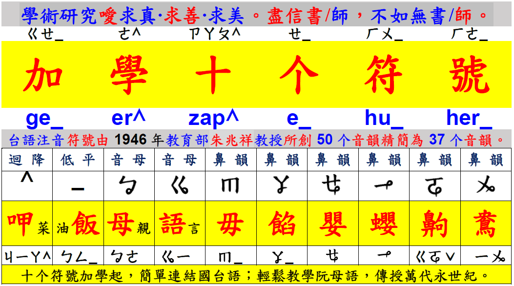

# 通用台語注音

## 摘要簡介

由「王啟陽」先生推展的「台語拼音方法」，其特點：
 - 現有的「國語注音符號」，添加十個符號，便能當作台語的注音符號；
 - 所有的「台語注音符號」，對映至「電腦鍵盤」的位置，同「通用拼音」。

這套台語拼音方法，王啟陽先生似乎未賦予「名稱」，為了此筆記的編撰之便，個人只好潛越，暫時將之稱作：「通用台語注音」。

### 加學十個符號

這套台語拚音方法的特點之一：套用原有的「國語注音符號」，再加學十個符號（兩個聲母注音符號；六個韻母注音符號；兩個聲調注音符號），就能用來標示漢字的「台語」讀音。

  <iframe style="position: absolute;
                 top: 0;
                 left: 0;
                 width: 100%;
                 height: 100%;"
    width="560" height="315" src="https://www.youtube.com/embed/4kDsQ4Dead0" frameborder="0" allow="accelerometer; autoplay; encrypted-media; gyroscope; picture-in-picture" allowfullscreen></iframe>

### 國語連結台語

說明已學過「國語注音符號」之人，何以能無痛，輕鬆地將此套台語拚音方法，當成
台語的拚音工具。

  <iframe style="position: absolute;
                 top: 0;
                 left: 0;
                 width: 100%;
                 height: 100%;"
    width="560" height="315" src="https://www.youtube.com/embed/UEdaBFHxV3g" frameborder="0" allow="accelerometer; autoplay; encrypted-media; gyroscope; picture-in-picture" allowfullscreen></iframe>

  <iframe style="position: absolute;
                 top: 0;
                 left: 0;
                 width: 100%;
                 height: 100%;"
    width="560" height="315" src="https://www.youtube.com/embed/WZ_p0To735g" frameborder="0" allow="accelerometer; autoplay; encrypted-media; gyroscope; picture-in-picture" allowfullscreen></iframe>

  <iframe style="position: absolute;
                 top: 0;
                 left: 0;
                 width: 100%;
                 height: 100%;"
    width="560" height="315" src="https://www.youtube.com/embed/pN-WWEs4K3w" frameborder="0" allow="accelerometer; autoplay; encrypted-media; gyroscope; picture-in-picture" allowfullscreen></iframe>

## 聲／韻／調結構

### 聲母

此方法稱「聲母」為「音母」，共 37 個。

  <iframe style="position: absolute;
                 top: 0;
                 left: 0;
                 width: 100%;
                 height: 100%;"
    width="560" height="315" src="https://www.youtube.com/embed/IVazhfJXAtE" frameborder="0" allow="accelerometer; autoplay; encrypted-media; gyroscope; picture-in-picture" allowfullscreen></iframe>

  <iframe style="position: absolute;
                 top: 0;
                 left: 0;
                 width: 100%;
                 height: 100%;"
    width="560" height="315" src="https://www.youtube.com/embed/rxr20ZdqWSU" frameborder="0" allow="accelerometer; autoplay; encrypted-media; gyroscope; picture-in-picture" allowfullscreen></iframe>

### 韻母

基楚的韻母，共 18 個。若再加入：入韻、複合韻，則台語的韻母共有 62 個。

  <iframe style="position: absolute;
                 top: 0;
                 left: 0;
                 width: 100%;
                 height: 100%;"
    width="560" height="315" src="https://www.youtube.com/embed/nqLC6qW36P0" frameborder="0" allow="accelerometer; autoplay; encrypted-media; gyroscope; picture-in-picture" allowfullscreen></iframe>

  <iframe style="position: absolute;
                 top: 0;
                 left: 0;
                 width: 100%;
                 height: 100%;"
    width="560" height="315" src="https://www.youtube.com/embed/67r67WvlC4E" frameborder="0" allow="accelerometer; autoplay; encrypted-media; gyroscope; picture-in-picture" allowfullscreen></iframe>

台語 62 韻母：

### 聲調

通用台語注音的聲調為：六加一聲調。

通用台語注音的聲調，為使國、台語的注音符號能儘可能通用；故基本上，繼承了國語注音符號的標示方法及次序。台語注音聲調符號的編排方式，說明如下：

 - 台語需要標注「迴揚聲」，罕用國語注音的「揚升聲」，故第二聲改為迴揚聲；

 - 台語需要標注「低促聲」，原國語的「輕聲」，改為第五聲，表低促聲；

 - 台語需要標注「低平聲」，故新增第六聲，為低平聲所用。

  <iframe style="position: absolute;
                 top: 0;
                 left: 0;
                 width: 100%;
                 height: 100%;"
    width="560" height="315" src="https://www.youtube.com/embed/jA8Q8TAfawM?start=223" frameborder="0" allow="accelerometer; autoplay; encrypted-media; gyroscope; picture-in-picture" allowfullscreen></iframe>

 

何以不用「台羅八聲調」的理由：

### 入韻

【入韻發聲示範】

  <iframe style="position: absolute;
                 top: 0;
                 left: 0;
                 width: 100%;
                 height: 100%;"
    width="560" height="315" src="https://www.youtube.com/embed/2gQABdOas2U" frameborder="0" allow="accelerometer; autoplay; encrypted-media; gyroscope; picture-in-picture" allowfullscreen></iframe>

【入韻發音表】：

  <iframe style="position: absolute;
                 top: 0;
                 left: 0;
                 width: 100%;
                 height: 100%;"
    width="560" height="315" src="https://www.youtube.com/embed/mW-yVxLvIwE" frameborder="0" allow="accelerometer; autoplay; encrypted-media; gyroscope; picture-in-picture" allowfullscreen></iframe>

  <iframe style="position: absolute;
                 top: 0;
                 left: 0;
                 width: 100%;
                 height: 100%;"
    width="560" height="315" src="https://www.youtube.com/embed/j5ekG9y90cY" frameborder="0" allow="accelerometer; autoplay; encrypted-media; gyroscope; picture-in-picture" allowfullscreen></iframe>

### 變調

說明台語在「聲調」的轉聲變調規則。

【示範教學】

  <iframe style="position: absolute;
                 top: 0;
                 left: 0;
                 width: 100%;
                 height: 100%;"
    width="560" height="315" src="https://www.youtube.com/embed/yX2SvAmoEiE" frameborder="0" allow="accelerometer; autoplay; encrypted-media; gyroscope; picture-in-picture" allowfullscreen></iframe>

  <iframe style="position: absolute;
                 top: 0;
                 left: 0;
                 width: 100%;
                 height: 100%;"
    width="560" height="315" src="https://www.youtube.com/embed/RQnWz31YXts" frameborder="0" allow="accelerometer; autoplay; encrypted-media; gyroscope; picture-in-picture" allowfullscreen></iframe>

## 示範與練習

### 聲調教學

示範「台語七聲調」及「變調轉聲規則」。

  <iframe style="position: absolute;
                 top: 0;
                 left: 0;
                 width: 100%;
                 height: 100%;"
    width="560" height="315" src="https://www.youtube.com/embed/jA8Q8TAfawM?start=223" frameborder="0" allow="accelerometer; autoplay; encrypted-media; gyroscope; picture-in-picture" allowfullscreen></iframe>

### 弟子規注音

### [六月茉莉注音](http://www.taiwanese-oki.idv.tw/?action=case&id=114)

## 參考資料

### 官網

[輕鬆學台語網站](http://www.taiwanese-oki.idv.tw/)

### YouTube 教學影片

[YouTube 播放清單：輕鬆學台語](https://www.youtube.com/watch?v=JZZ5eoruohw&list=PLPVxvRAhFgod3-JTgqKHLkfK-CTFWyPiL&index=1)
