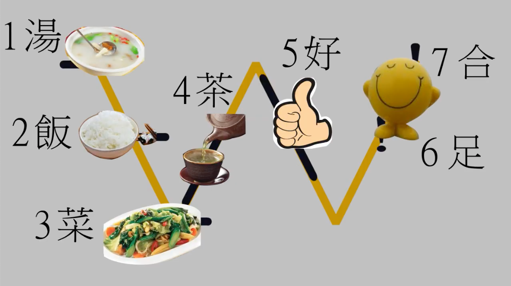

# 無名台語注音

同屬注音符號改良後的台語發聲方法，因作者未示其名，故暫稱：無名台語注音。

《台語音標，只須用國語注音符號》： 用國語注音符號就可完全標出台語，不須記特別符號，不須裝特殊軟體。這個台語注音符號表簡單明瞭。

用這套台語ㄅㄆㄇ，學過國語ㄅㄆㄇㄈ的人都能很快掌握台語發音，而且手寫，輸入都很簡單。

## 聲母與韻母

### 台語注音符號

 台語音標，自現有的國語注音符號裁剪、改良而得，全部的注音符號如下表所示。

<iframe width="560" height="315"
  src="https://www.youtube.com/embed/EEndKSmeG5I"
  title="YouTube video player" frameborder="0"
  allow="accelerometer; autoplay; clipboard-write; encrypted-media; gyroscope; picture-in-picture" allowfullscreen></iframe>

### 背記方法

使用歌唱方式，背記台語注音符號的方法。

《台語注音符號可以用唱的喔》： 小星星這首兒歌是翻譯自 Twinkle Twinkle Little Stars. 早有人將它改成英文字母兒歌。

台語注音符號也可它的旋律來唱。這是教小朋友台語ㄅㄆㄇ的最好方法。

<iframe width="560" height="315"
  src="https://www.youtube.com/embed/vEulNQ-NWzY"
  title="YouTube video player" frameborder="0"
  allow="accelerometer; autoplay; clipboard-write; encrypted-media; gyroscope; picture-in-picture" allowfullscreen></iframe>

### 鍵盤配置

 台語注音符號在電腦輸入，使用的按鍵。

<iframe width="560" height="315"
  src="https://www.youtube.com/embed/k2Bxdl_uhoA"
  title="YouTube video player" frameborder="0"
  allow="accelerometer; autoplay; clipboard-write; encrypted-media; gyroscope; picture-in-picture" allowfullscreen></iframe>

## 聲調

用一個 W 掌握台語聲調。

 - 湯 - 臺語萌典 陰平 1 無符號
 - 飯 - 臺語萌典 陽去 7 ˫
 - 菜 - 臺語萌典 陰去 3 ˪
 - 茶 - 臺語萌典 陽平 5 ˊ
 - 好 - 臺語萌典 陰上 2 ˋ
 - 足 - 臺語萌典 陰入 4 ㄅ, ㄉ, ㄍ, ㄏ
 - 合 - 臺語萌典 陽入 8 ㄅ̇  , ㄉ̇  , ㄍ̇  , ㄏ̇

<iframe width="560" height="315"
  src="https://www.youtube.com/embed/lfSNWNlcNeA"
  title="YouTube video player" frameborder="0"
  allow="accelerometer; autoplay; clipboard-write; encrypted-media; gyroscope; picture-in-picture" allowfullscreen></iframe>

## 變調規則

說話時，文字的原聲調，會依據以下之規則變調。

《台語變調很獨特, 時時需變. 教你記住如何變》： 國語在三聲三聲連發的時候,
前一音會變成二聲。但是台語每一個音都可能變，完全看它處於行位或止位。 如何變，有確定的規則。這裡講變調規則。

<iframe width="560" height="315"
  src="https://www.youtube.com/embed/fyfTqM8UMg8"
  title="YouTube video player" frameborder="0"
  allow="accelerometer; autoplay; clipboard-write; encrypted-media; gyroscope; picture-in-picture" allowfullscreen></iframe>

## 參考文章

 - [第1865回-台灣方音符號-3-用一個W記住台語聲調](https://glglace.blogspot.com/2021/05/1865-3-w.html)
