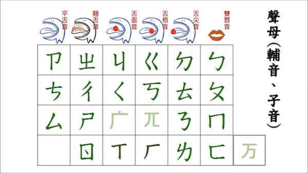
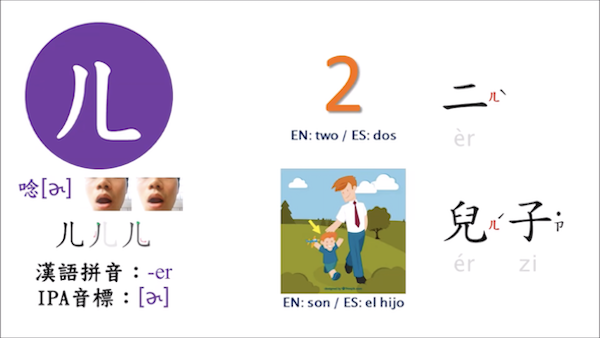
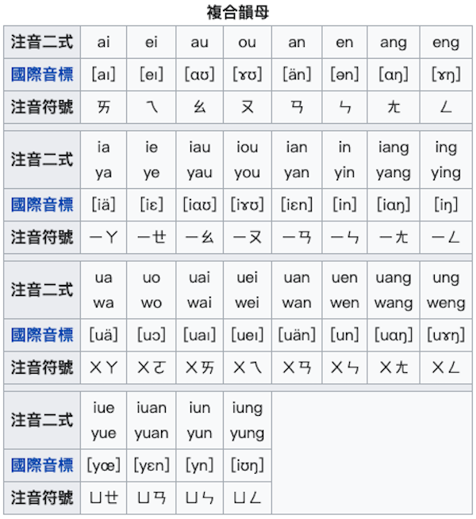

# 國語注音符號

## 摘要簡介

## 拚音系統

### 聲母

### 韻母

### 聲調

## 聽說練習

### 聲母

<iframe width="560" height="315" src="https://www.youtube.com/embed/cq3Iio2h0Qk" title="YouTube video player" frameborder="0" allow="accelerometer; autoplay; clipboard-write; encrypted-media; gyroscope; picture-in-picture" allowfullscreen></iframe>

### 韻母

<iframe width="560" height="315" src="https://www.youtube.com/embed/BaKMZRhM5zk" title="YouTube video player" frameborder="0" allow="accelerometer; autoplay; clipboard-write; encrypted-media; gyroscope; picture-in-picture" allowfullscreen></iframe>

## 參考資料

### 維基百科

國語注音符號、通用拼音、國際音標（IPA）比較。

**【聲母】**

**【韻母／基本母音】**

**【韻母／複合韻母】**

### 國際音標

國際音標又稱「IPA 音標」。

<iframe width="560" height="315" src="https://www.youtube.com/embed/z_arcbARtaU" title="YouTube video player" frameborder="0" allow="accelerometer; autoplay; clipboard-write; encrypted-media; gyroscope; picture-in-picture" allowfullscreen></iframe>

### [通用拼音](https://zh.wikipedia.org/wiki/%E9%80%9A%E7%94%A8%E6%8B%BC%E9%9F%B3)

通用拼音是源自臺灣的拉丁字母漢字標音方案，包含了「華語通用拼音」、「臺語通用拼音」、「客語通用拼音」三種拼音方案。一般情況下，通用拼音常用做「華語通用拼音」的簡稱，也是中華民國政府在2002年至2008年採用的中文拉丁化拼音法。中華民國教育部於2008年12月18日修正「中文譯音使用原則」，改採漢語拼音為標準。目前，部分縣市政府使用通用拼音翻譯地名。
